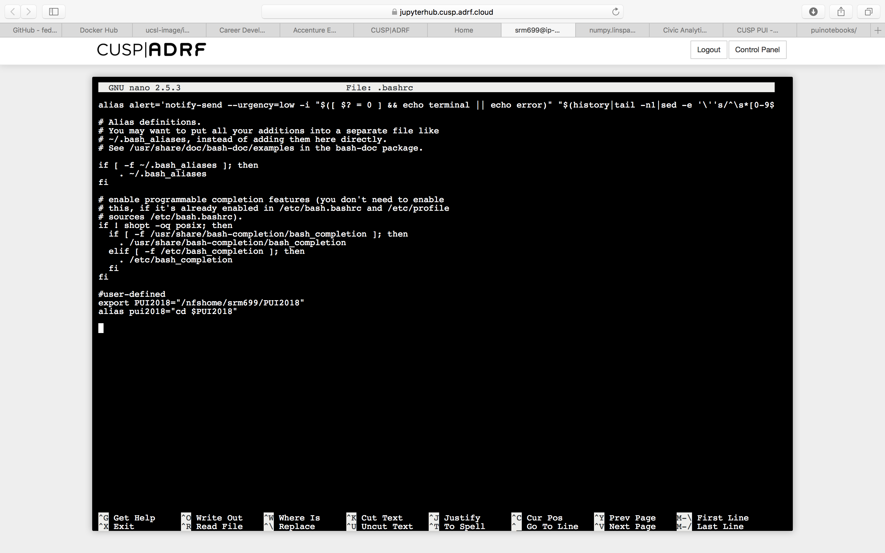
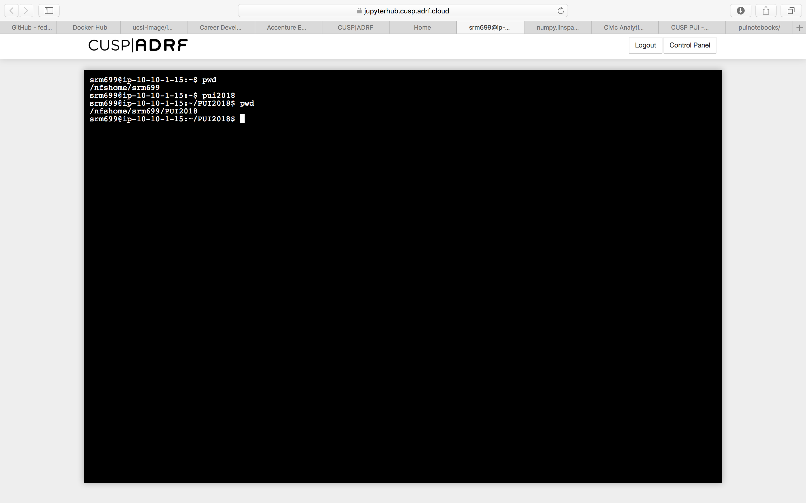

This is the first homework where we set up our environments.
We learnt how to create environment variables and how they can be run each time by default if they are saved in the bashrc file.
We also learnt how to create an alias and how that could be useful.

