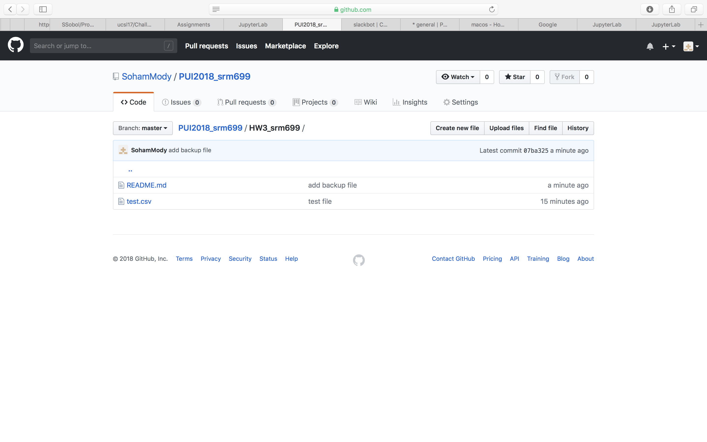

In this homework, I learnt how to delete data(probably sensitive) from a github repository as well as the history of that repository. 
I also inputted a csv file using pandas and played around with it in a Jupyter notebook. Additionally, I learnt how to pull data using APIs(json file).
Other than this, I wrote a Python script by pulling real-time feeds from MTA and then taking in arguments from the user and returning the required fields from a Json file.
Finally, I wrote specific data that was needed from these feeds(json file) into a csv file provided by the user.

I worked by myself on this assignment and it has been done entirely by me.

