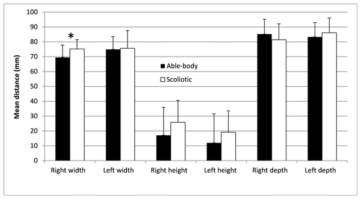
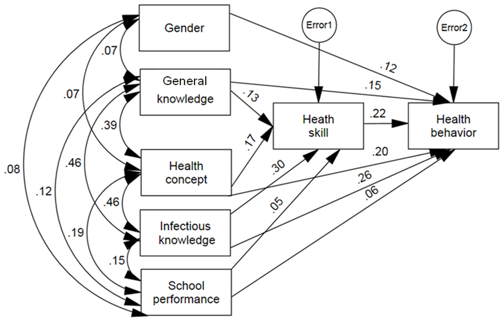
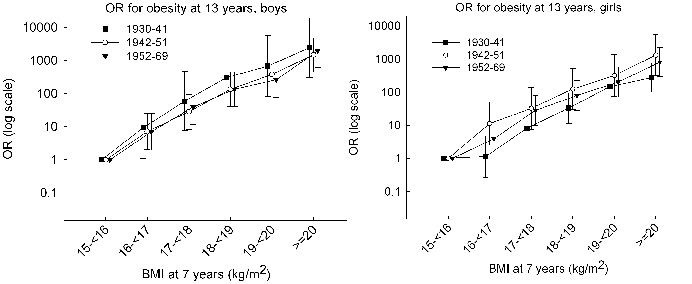

# HW5
This homework was done by me not working in a group. 
Statistical tests were surveyed  and performed in this assignment and also, peer assignments were reviewed where I reviewed the assignment of tingyu chan.

## Test 1: Checking whether pelvic morphology variables are the same for adloescent scoliotic and able-bodied girls.

| **Statistical Analyses**	|  **IV(s)**  |  **IV type(s)** |  **DV(s)**  |  **DV type(s)**  |  **Control Var** | **Control Var type**  | **Question to be answered** | **_H0_** | **alpha** | **link to paper**| 
|:----------:|:----------|:------------|:-------------|:-------------|:------------|:------------- |:------------------|:----:|:-------:|:-------|
MANOVA	Path| 6, Right Width, Left Width, Right Height, Left Height, Right Depth, Left Depth | continous | 1, scoliotic or able-bodied | categorical | 4, age, height, mass, BMI, Cobb angle | continuous | Do pelvic morphology variables of scoliotic girls differ from those of able-bodied girls? | Pelvic Morphology Variables(Scoliotic girls) ~= Pelvic Morphology Variables(Able-bodied girls) | 0.05 | [Pelvic Morphology Characteristics of Adolescent Able-Bodied and Scoliosis Girls](https://journals.plos.org/plosone/article?id=10.1371/journal.pone.0070205) |

## Test 2: Check how health literacy and other factors affect Health Skills and behavious in adolescents.

| **Statistical Analyses**	|  **IV(s)**  |  **IV type(s)** |  **DV(s)**  |  **DV type(s)**  |  **Control Var** | **Control Var type**  | **Question to be answered** |Denmark **_H0_** | **alpha** | **link to paper**| 
|:----------:|:----------|:------------|:-------------|:-------------|:------------|:------------- |:------------------|:----:|:-------:|:-------|
Path Analysis	| 5, Gender, General Knowledge, Health Concept, Infectious Knowledge,School Performance | Category or range | 2, Health Skill, Health Behaviour | categorical | 1, age | continuous | Which factors affect the health skill and behaviour directly as well as indirectly?   | Gender,General Knowledge, Health Concept, Infectious Knowledge and School Performance have no effect on the health skill and behaviour of an individual| 0.05 | [factors affecting health behaviour and skill](https://journals.plos.org/plosone/article?id=10.1371/journal.pone.0104406) |

## Test 3: Does being obese earlier influence being obese later

| **Statistical Analyses**	|  **IV(s)**  |  **IV type(s)** |  **DV(s)**  |  **DV type(s)**  |  **Control Var** | **Control Var type**  | **Question to be answered** | **_H0_** | **alpha** | **link to paper**| 
|:----------:|:----------|:------------|:-------------|:-------------|:------------|:------------- |:------------------|:----:|:-------:|:-------|
 Logistic Regression   	| 1,BMI groups | Categorical   	| 1, Obesity (odds ratio)                                                                                                                                                                                                                                                                  | Categorical or continuous                                                                                                                                    | 2,Birth Cohort,Gender                                                                                                       	| Categorical         	| Does  persistent obesity from age 7 to 13   contribute to the rise in the prevalence of obesity?                                  	| The odds of being obese at 7 years don't increase the odds of being obese at 13. 	| 0.05  	| [Does Persistence increase the Prevalence of Childhood Obesity]( https://journals.plos.org/plosone/article?id=10.1371/journal.pone.0042521) 	|

