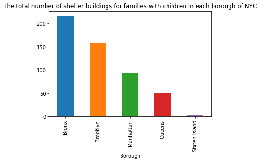
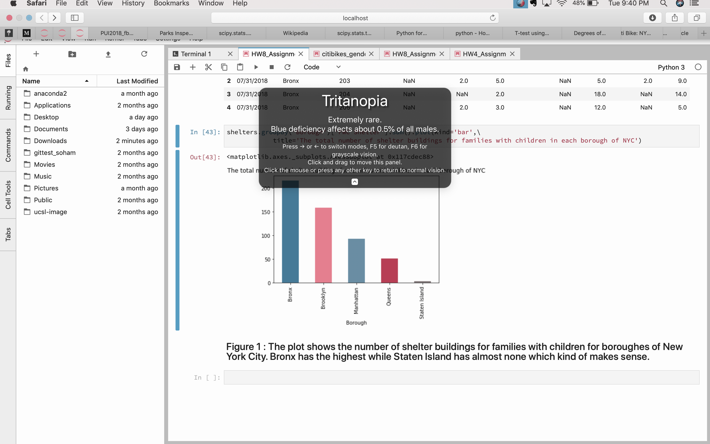

## This is Homework 8 for the subject Principle of Urban Informatics.

### Assignment-1 : I have plotted the number of shelter buildings for families with children grouped by the NYC boroughs.

###### Figure 1 : The plot shows the number of shelter buildings for families with children for boroughes of New  York City. Bronx has the highest while Staten Island has almost none which kind of makes sense. 

##### Figure 2: The plot being tested for its visibility to people with various colour blindnesses.(the one in the screenshot being Tritanopia)

### Assignment-2 : I have completed my analysis for the citibike project started in Homework 4. I have created a report on Authorea which is available [here](https://www.authorea.com/users/249613/articles/335964-citibike-usage-data-analysis-in-python)  

#### This assignment has been done by me working by myself.
